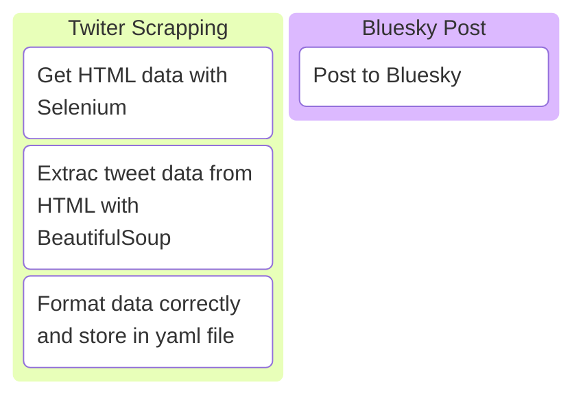

# twitte2bluesky

## Workflow Twitter2Bluesky

```mermaid
kanban
    column1[Twiter Scrapping]
      taskT1[Get HTML data with Selenium]
      taskT2[Extrac tweet data from HTML with BeautifulSoup]
      taskT3[Format data correctly and store in yaml file]
    column2[Bluesky Post]
      taskB1[Post to Bluesky]
```